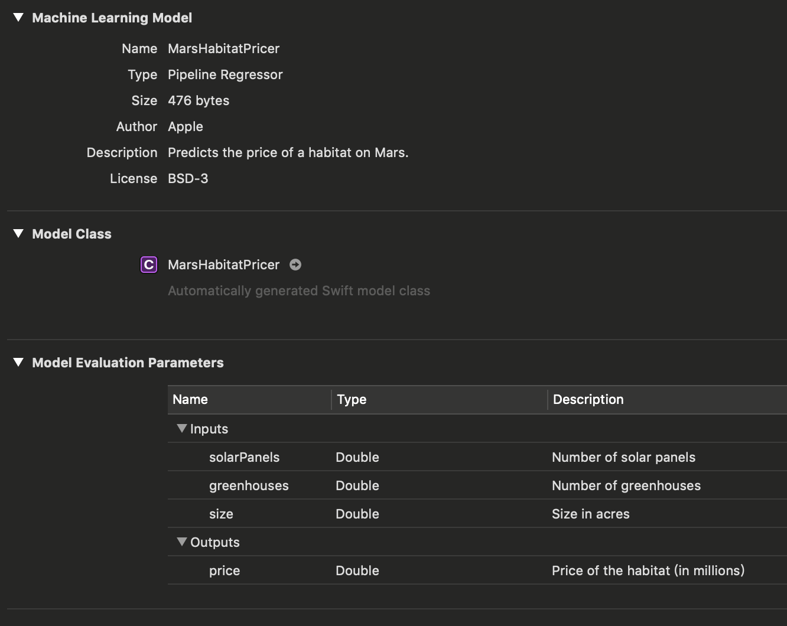

# 简单给你的APP集成Core ML模型

下面我们就看一下将Core ML模型集成到您的APP中,传递给模型输入数据,并产生模型的预测数据

## 概要

下面我们看一个案例,此案例APP使用经过训练的模型`MarsHabitatPricer.mlmodel`来预测火星上的栖息地价格

## 将模型加到您的Xcode项目中

将模型文件拖入项目中

我们可以打开Xcode中的模型来查看相关模型信息,包括模型类型及其与其输入和输出



模型的输入时太阳能电池板和温室的数量,以及栖息地的面积(英亩).

模型的输出是栖息地的预测价格

## 在代码中创建模型

Xcode会使用模型输入和输出的信息来自动生成模型的自定义编程接口,用于与代码中的模型进行交互.

对于`MarsHabitatPricer.mlmodel`,Xcode生成用于表示模型的`MarsHabitatPricer`,模型输入`MarsHabitatPricerInput`和模型输出`MarsHabitatPricerOutput`接口

使用生成的`MarsHabitatPricer `类来初始化模型对象

``` swift
let model = MarsHabitatPricer()
```

## 获取输入值传递给模型对象

本示例APP使用UIPickerView从用户获取模型的输入值:


``` swift
func selectedRow(for feature: Feature) -> Int {
    return pickerView.selectedRow(inComponent: feature.rawValue)
}

let solarPanels = value(for: selectedRow(for: .solarPanels), feature: .solarPanels)
let greenhouses = value(for: selectedRow(for: .greenhouses), feature: .greenhouses)
let size = value(for: selectedRow(for: .size), feature: .size)
```

## 使用模型做预测

`MarsHabitatPricer`类生成了一个
`prediction(solarPanels:greenhouses:size:)` 方法用于从模型的输入值预测价格,改方法的结果返回值是 `MarsHabitatPricerOutput` 示例.

``` swift
guard let marsHabitatPricerOutput = try? model.prediction(solarPanels: solarPanels, greenhouses: greenhouses, size: size) else {
    fatalError("Unexpected runtime error.")
}
```

获取`marsHabitatPricerOutput`的 `price` 属性,得到一个预测的价格并更新UI

``` swift
let price = marsHabitatPricerOutput.price
priceLabel.text = priceFormatter.string(for: price)
```


## 构建并运行一个Core ML App

Xcode将Core ML模型编译经过优化以在设备上运行的资源.这个经过优化的模型包含在您的应用程序 包中,并且是在应用程序在设备运行时进行预测的

